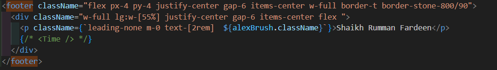

# Using Google Fonts API (Newer Version with Latest Updates - (Recommended for Next.js 13-15))

## ✅ Step 1: Create a `fonts.ts` file (or in `layout.tsx` directly):

```typescript
// app/fonts.ts
import { Alex_Brush } from 'next/font/google';
export const alexBrush = Alex_Brush({
  weight: '400',
  subsets: ['latin'],
  display: 'swap',
});
```

## ✅ Step 2: Use in your component

```typescript
import { alexBrush } from './fonts'; 
<p className={alexBrush.className}>Hello with Alex Brush</p>

```

## Example Usecase:



[Refer the component to understand the usecase](../components/HiddenFooter.tsx)
